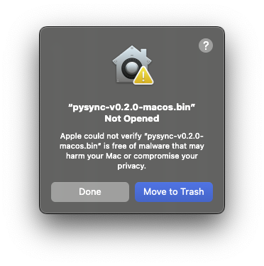
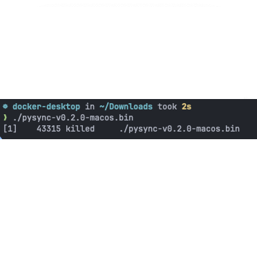
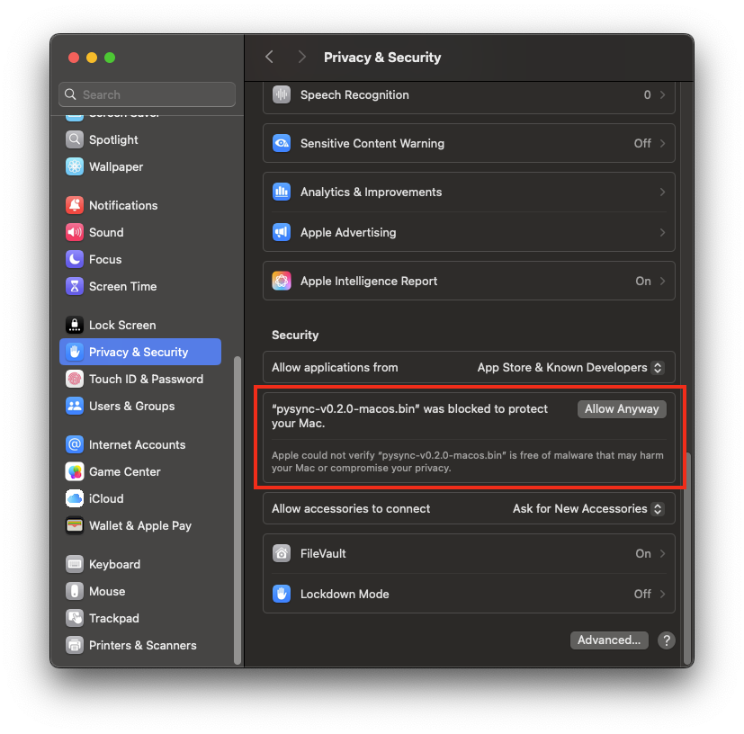
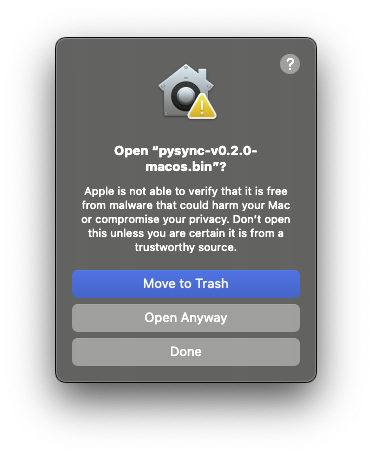

# pysync
Sync your pyproject.toml and uv lockfile!

Note: This project is meant as a temporary solution until **uv** integrates this functional natively. 
See https://github.com/astral-sh/uv/issues/6794.

## Installation
1. Download the latest binary from the [releases page](https://github.com/kedvall/pysync/releases)
2. Copy it to a directory on your `PATH` and set the appropriate permissions

For example, using a release of **v0.2.0** on Mac:
```shell
sudo cp pysync-v0.2.0-macos.bin /usr/local/bin/  # Copy to install dir
sudo ln -s /usr/local/bin/pysync-v0.2.0-macos.bin /usr/local/bin/pysync  # Create version-independent symlink
sudo chmod +x /usr/local/bin/pysync  # Set execute permission for the current user
```

## Usage
Simply run the **pysync** command!   
The first argument (optional) sets the target directory (defaults to the current directory).
Any subsequent arguments are directly passed through to **uv sync**:
```shell
# In my-project directory
pysync  # Syncs the environment of the current directory (my-project)
pysync ../another-project-dir  # Syncs the environment of another-project-dir
pysync sub-project  # Sync the environment of sub-project

# Any additional args will be directly passed to 'uv syc'
pysync --upgrade  # Runs 'uv sync --upgrade' then syncs the environment of my-project (cwd)
pysync --upgrade --index github=https://github.com/my-project  # Same, --index and other args are passed through to uv

# Both a directory argument and uv sync arguments can be passed together
# This synchronizes the environment of another-project-dir with a command of 'uv sync --upgrade'
pysync /absolute/path/to/another-project-dir --upgrade

# Pysync will automatically detect if the first arg given is a valid path
# If not, and if the arg starts with -/--, pysync will automatically use the environment of the current directory
# The following commands are equivalent: 
pysync
pysync .
# as are:
pysync --upgrade
pysync . --upgrade
```
- Pysync internally runs **uv sync** to ensure the lockfile is up to date
- It then checks the minimum versions of top-level dependencies in your pyproject.toml file against installed versions
in your uv.lockfile. If they differ, it will bump the minimum version specified in the pyproject.toml file
- If any dependencies were updated, pysync will re-run the **uv sync** command to ensure the changes are valid and re-lock


## Additional Info

### Mac Permissions
If you're installing this tool on a modern version of macOS, you'll likely get a security warning that pops up the first
time you try to run it. It looks like this:
    
You'll need to go to Settings -> Privacy & Security -> Scroll down and click **Allow Anyway**:
   
You can now try launching pysync again. You'll get another popup confirming that you really want to run it. 
Click **Open Anyway**. You'll be prompted for you password. Enter it.
   
Now, finally, you should be able to run pysync without an issue. Subsequent runs should have no warning dialogs or popups...
